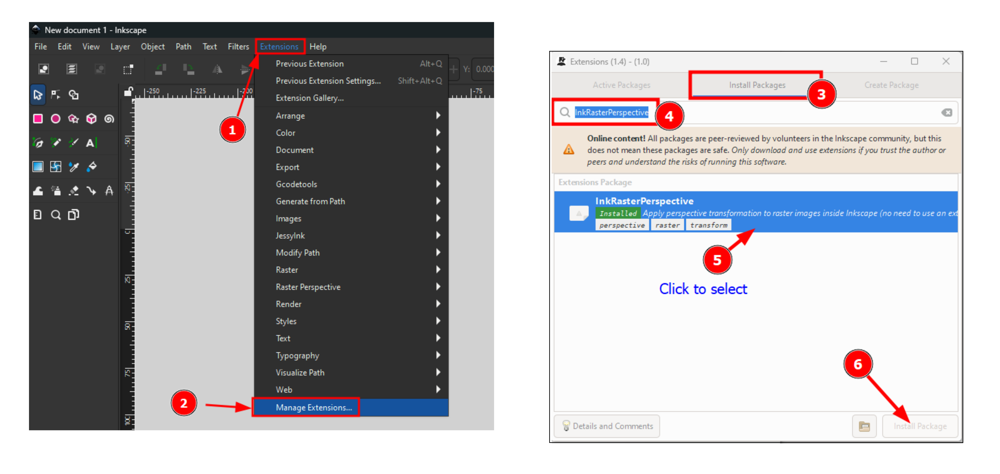
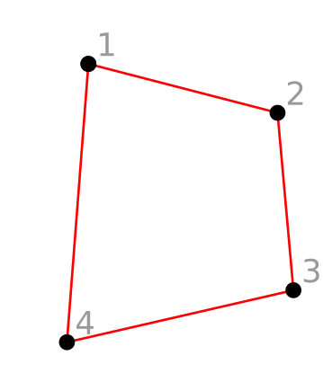
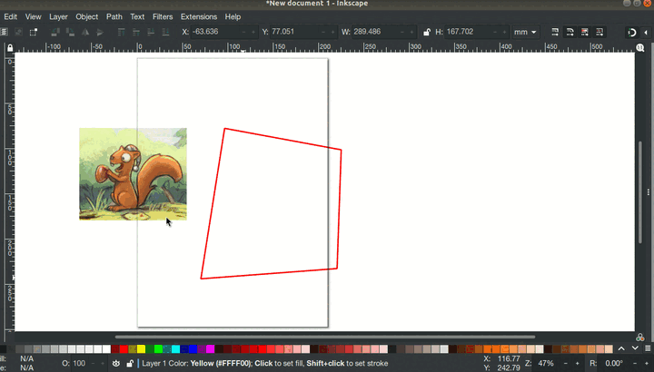

# Raster Perspective

Apply perspective transformation to bitmap images using the selected path as envelope, without the need to use an external software to transform the image. It works for both embedded and linked images.

# Installation:

To install this extension, you can either use the extensions manager: (from the menu **Extensions** > **Manage Extensions...**), or follow the instructions below for manual installation.

## 1. Using the extensions manager:

Go to **Extensions** > **Manage Extension...**. A separate window appears, click on the "Install Packages" tab, and type `InkRasterPerspective` within the search box and press <kbd>Enter</kbd>. Then click on the button "Install Package". These steps are illustrated below:



## 2. Manual Installation

### 2.1. On Linux:

```
cd $HOME/.config/inkscape/extensions
git clone https://github.com/s1291/InkRasterPerspective.git
```

* Open Inkscape (if it is already open, close then re-open it) and you should find the extension under: **Extensions** > **Raster Perspective** > **Perspective**.

### 2.2. On Windows:

* Download the most recent version (direct link: [zip](https://github.com/s1291/InkRasterPerspective/archive/refs/heads/master.zip))
* Extract it and copy the files `imagePerspective.py` and `imagePerspective.inx` to `C:\Program Files\Inkscape\share\inkscape\extensions`.


# How to use this extension

> This extension was tested with the following versions of Inkscape `1.2.x`, `1.3.x`, and `1.4`.

1. Select the raster image and the quadrangle path (envelope) . Make sure the envelope nodes are ordered as follows:



For more details on how to find the nodes order for a path, check out this [post](https://graphicdesign.stackexchange.com/a/155289/147300).

2. Extensions > Raster Perspective > Perspective

See below:



# Author

Samir OUCHENE, 2021-2025

All code is licensed under the GNU General Public License version 3. See [the license file](https://github.com/s1291/InkRasterPerspective/blob/master/LICENSE) for details.
